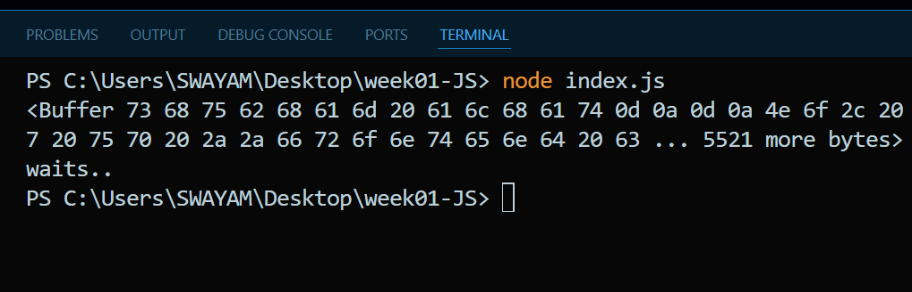

# Javascript week 01

### compiled vs interpreted languages

- c++,Rust and go are compiled languages and python and JS are interpreted languages

Javascript is simgle threaded language

## Async and sync JS

synchronous eg-

```javascript
import fs from "fs";

const data = fs.readFileSync("huge-file.txt");

console.log(data);
console.log("waits..");
```

```bash
PS C:\Users\SWAYAM\Desktop\week01-JS> node index.js
<Buffer 73 68 75 62 68 61 6d 20 61 6c 68 61 74 0d 0a 0d 0a 4e 6f 2c 20 79 6f 75 27 72 65 20 6d 69 78 69 6e 67 20 75 70 20 2a 2a 66 72 6f 6e 74 65 6e 64 20 63 ... 5521 more bytes>
waits..
PS C:\Users\SWAYAM\Desktop\week01-JS>
```



---

Async - eg

```javascript
import fs from "fs";

fs.readFile("huge-file.txt", "utf-8", (err, data) => {
  console.log(data); // Runs later when file is ready
});

console.log("This runs immediately!"); // Doesn't wait!
```

Output would be:

```
This runs immediately!
[... then file contents when ready ...]
```

```bash
[nodemon] starting `node index.js`
This runs immediately!
<Buffer 73 68 75 62 68 61 6d 20 61 6c 68 61 74 0d 0a 0d 0a 4e 6f 2c 20 79 6f 75 27 72 65 20 6d 69 78 69 6e 67 20 75 70 20 2a 2a 66 72 6f 6e 74 65 6e 64 20 63 ... 5521 more bytes>
[nodemon] clean exit - waiting for changes before restart
```
